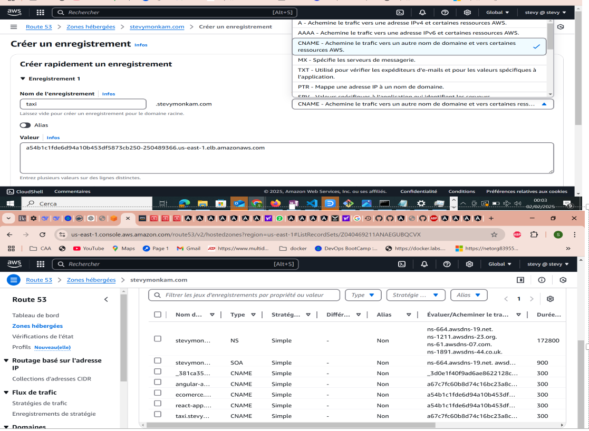
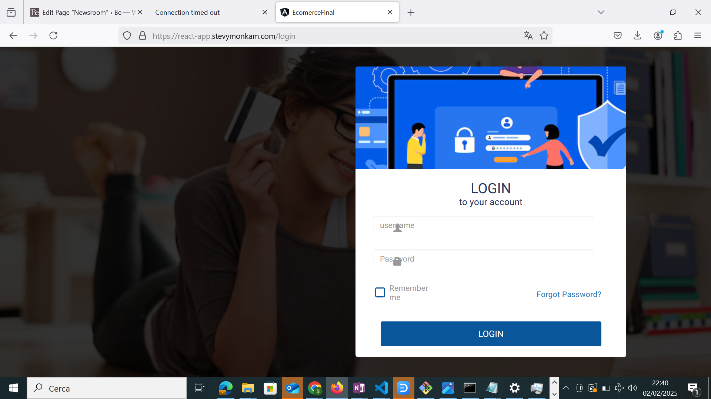
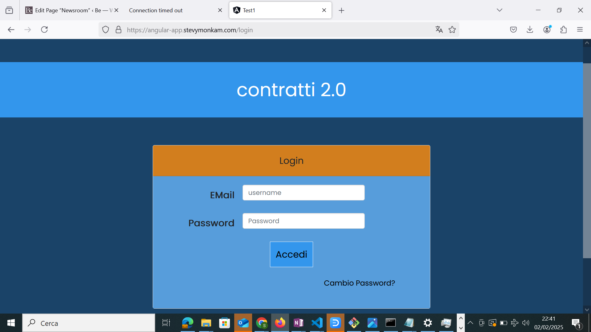

# Kubernetes-Deployment--AWS-Scalable-and-Secure-Infrastructure

This project presents a complete infrastructure to deploy applications on a Kubernetes cluster hosted on AWS. The stack has been deployed with CloudFormation. The architecture is designed for high availability, strong security, and scalability thanks to AWS services like CloudFront, WAF,ACM, Route 53,internet gateway,ALB,external-dns,vpc.subnet,Ec2,bastion, and a Kubernetes Ingress.


| **AWS EKS DEPLOY WITH CLOUDFORMATION**      | **high availability, scalability and security (HTTPS AND CERTIFICATE) with (DNS, ACM, INGRESS, ROUTE 53, EXTERNAL-DNS)**     |
|------------------|-------------|
|  |  |


### AWS EKS DEPLOY WITH CLOUDFORMATION

This CloudFormation stack deploys a pre-configured EC2 instance to create an EKS (Kubernetes) cluster on AWS. It includes:

IAM Resources: Creates a role and instance profile with permissions to manage the cluster.
EC2 Instance: Deploys an instance with all the necessary tools (kubectl, AWS CLI, etc.) and a bootstrap script to launch the EKS cluster.
Security Group: Allows SSH (port 22) and HTTP (port 80) connections.
Automated EKS Deployment: Downloads an EKS template and launches a cluster in two public subnets.
Finally, outputs display the EC2 instance ID, public address, and availability zone.

## [code stack cloudformation](aws-eks.yaml)


###  high availability, scalability and security (HTTPS AND CERTIFICATE) with (DNS, ACM, INGRESS, ROUTE 53, EXTERNAL-DNS)
## Composants et flux de travail


# Secure Deployment of Angular & React Apps on AWS EKS with SSL & Route 53 (less abtimal solution without ingress controller)
## Overview
This guide explains how to deploy Angular and React applications on AWS EKS with a Route 53 domain and SSL using AWS Certificate Manager (ACM).

## Table of Contents
- [Prerequisites](#prerequisites)
- [Deploy Angular and React Apps](#deploy-angular-and-react-apps)
- [Configure Load Balancer and SSL](#configure-load-balancer-and-ssl)
- [Create SSL Certificate in AWS ACM](#create-ssl-certificate-in-aws-acm)
- [Configure DNS in Route 53](#configure-dns-in-route-53)
- [Final Steps](#final-steps)

---

## Prerequisites
Before proceeding, ensure you have:
- An AWS account with EKS, ACM, and Route 53 set up
- `kubectl` and `aws-cli` installed and configured
- A registered domain in Route 53

---

## Deploy Angular and React Apps

### Angular App Deployment
```yaml
apiVersion: apps/v1
kind: Deployment
metadata:
  name: angular-app
  namespace: default
spec:
  replicas: 3
  selector:
    matchLabels:
      app: angular-app
  template:
    metadata:
      labels:
        app: angular-app
    spec:
      containers:
      - name: angular-app-container
        image: stevymonkam/kuberneteimgfront:1.0
        ports:
        - containerPort: 80
```

### React App Deployment
```yaml
apiVersion: apps/v1
kind: Deployment
metadata:
  name: react-app
  namespace: default
spec:
  replicas: 3
  selector:
    matchLabels:
      app: react-app
  template:
    metadata:
      labels:
        app: react-app
    spec:
      containers:
      - name: react-app-container
        image: stevymonkam/contratti-image:1.0
        ports:
        - containerPort: 80
```

---

## Configure Load Balancer and SSL

### Angular App Service
```yaml
apiVersion: v1
kind: Service
metadata:
  name: angular-app-service
  annotations:
    service.beta.kubernetes.io/aws-load-balancer-ssl-cert: "arn:aws:acm:us-east-1:615299770598:certificate/a4806da9-3d96-45f2-a08d-05e380e9ef5e"
    service.beta.kubernetes.io/aws-load-balancer-backend-protocol: "http"
    service.beta.kubernetes.io/aws-load-balancer-ssl-ports: "443"
    service.beta.kubernetes.io/aws-load-balancer-connection-idle-timeout: "3600"
spec:
  selector:
    app: angular-app
  ports:
    - name: http
      port: 80
      targetPort: 80
    - name: https
      port: 443
      targetPort: 80
  type: LoadBalancer
```

### React App Service
```yaml
apiVersion: v1
kind: Service
metadata:
  name: react-service-app
  annotations:
    service.beta.kubernetes.io/aws-load-balancer-ssl-cert: "arn:aws:acm:us-east-1:615299770598:certificate/a4806da9-3d96-45f2-a08d-05e380e9ef5e"
    service.beta.kubernetes.io/aws-load-balancer-backend-protocol: "http"
    service.beta.kubernetes.io/aws-load-balancer-ssl-ports: "443"
    service.beta.kubernetes.io/aws-load-balancer-connection-idle-timeout: "3600"
spec:
  selector:
    app: react-app
  ports:
    - name: http
      port: 80
      targetPort: 80
    - name: https
      port: 443
      targetPort: 80
  type: LoadBalancer
```

---
## Deploy Java Backend and MySQL Database angular-app

### Java Backend Deployment
```yaml
apiVersion: apps/v1
kind: Deployment
metadata:
  name: java-backend
  namespace: default
spec:
  replicas: 2
  selector:
    matchLabels:
      app: java-backend
  template:
    metadata:
      labels:
        app: java-backend
    spec:
      containers:
      - name: java-backend-container
        image: myrepo/java-backend:1.0
        ports:
        - containerPort: 8080
        env:
        - name: DB_HOST
          value: mysql-service
        - name: DB_USER
          value: root
        - name: DB_PASSWORD
          value: password
```

### Java Backend Service
```yaml
apiVersion: v1
kind: Service
metadata:
  name: java-backend-service
spec:
  selector:
    app: java-backend
  ports:
    - protocol: TCP
      port: 8080
      targetPort: 8080
  type: ClusterIP
```

### MySQL Database Deployment
```yaml
apiVersion: apps/v1
kind: Deployment
metadata:
  name: mysql
  namespace: default
spec:
  replicas: 1
  selector:
    matchLabels:
      app: mysql
  template:
    metadata:
      labels:
        app: mysql
    spec:
      containers:
      - name: mysql-container
        image: mysql:5.7
        ports:
        - containerPort: 3306
        env:
        - name: MYSQL_ROOT_PASSWORD
          value: password
        - name: MYSQL_DATABASE
          value: mydatabase
```

### MySQL Service
```yaml
apiVersion: v1
kind: Service
metadata:
  name: mysql-service
spec:
  selector:
    app: mysql
  ports:
    - protocol: TCP
      port: 3306
      targetPort: 3306
  type: ClusterIP
```

---


## Create SSL Certificate in AWS ACM
1. Navigate to **AWS Certificate Manager (ACM)**.
2. Generate a new **public SSL certificate**.
3. Copy the **ARN** of the certificate and replace it in the service annotations above.

4. 

To apply the configurations:
```sh
kubectl apply -f .
```
 

  
---

## Configure DNS in Route 53
1. Navigate to **AWS Route 53**.
2. Create an **A record** pointing to the Load Balancer.
3. Use an **Alias record** if supported.
4. Verify that the domain resolves correctly.


 
 
---

## Final Steps
After completing these steps:
1. Applications are deployed on **EKS**.
2. **Load Balancers** expose them securely with **SSL**.
3. **Route 53** links the domain to the Load Balancer.

Your applications are now secure and publicly accessible over **HTTPS**! 🎉

---


 

  


# Deploy EKS App with Ingress, ExternalDNS, and AWS Load Balancer Controller (BEST SOLUTION)

## Overview
This guide explains how to deploy Angular and React applications on AWS EKS using Ingress, ExternalDNS, and AWS Load Balancer Controller for managing traffic, SSL, and domain resolution via Route 53.

## Table of Contents
- [Prerequisites](#prerequisites)
- [Deploy Angular and React Apps](#deploy-angular-and-react-apps)
- [Configure Ingress and SSL](#configure-ingress-and-ssl)
- [Set Up ExternalDNS](#set-up-externaldns)
- [Install AWS Load Balancer Controller](#install-aws-load-balancer-controller)
- [Set Up AWS CloudFront](#Set-Up-AWS-CloudFront)
- [Set Up AWS WAF](#Set-Up-AWS-WAF)
- [Final Steps](#final-steps)

---

## Prerequisites
Before proceeding, ensure you have:
- An AWS account with EKS, ACM, and Route 53 set up
- `kubectl` and `aws-cli` installed and configured
- A registered domain in Route 53
- AWS Load Balancer Controller installed
- ExternalDNS configured to manage Route 53 records

---

## Deploy Angular and React Apps

### Angular App Deployment
```yaml
apiVersion: apps/v1
kind: Deployment
metadata:
  name: angular-app
  namespace: default
spec:
  replicas: 3
  selector:
    matchLabels:
      app: angular-app
  template:
    metadata:
      labels:
        app: angular-app
    spec:
      containers:
      - name: angular-app-container
        image: stevymonkam/kuberneteimgfront:1.0
        ports:
        - containerPort: 80
```

### React App Deployment
```yaml
apiVersion: apps/v1
kind: Deployment
metadata:
  name: react-app
  namespace: default
spec:
  replicas: 3
  selector:
    matchLabels:
      app: react-app
  template:
    metadata:
      labels:
        app: react-app
    spec:
      containers:
      - name: react-app-container
        image: stevymonkam/contratti-image:1.0
        ports:
        - containerPort: 80
```

---


## Install AWS Load Balancer Controller
1. Install the AWS Load Balancer Controller :
```sh
## AWS Load balancer ##

curl –silent –location « https://github.com/weaveworks/eksctl/releases/latest/download/eksctl_$(uname -s)_amd64.tar.gz » | tar xz -C /tmp
sudo mv /tmp/eksctl /usr/local/bin

curl -o iam-policy.json https://raw.githubusercontent.com/kubernetes-sigs/aws-load-balancer-controller/v2.1.2/docs/install/iam_policy.json

aws iam create-policy \
–policy-name AWSLoadBalancerControllerIAMPolicy \
–policy-document file://iam-policy.json

eksctl create iamserviceaccount \
–cluster=EKS \
–namespace=kube-system \
–name=aws-load-balancer-controller \
–attach-policy-arn=arn:aws:iam::312601499315:policy/AWSLoadBalancerControllerIAMPolicy \
–override-existing-serviceaccounts \
–approve

kubectl apply –validate=false -f https://github.com/jetstack/cert-manager/releases/download/v1.0.2/cert-manager.yaml

wget https://raw.githubusercontent.com/kubernetes-sigs/aws-load-balancer-controller/v2.1.2/docs/install/v2_1_2_full.yaml

# Update file with cluster name

kubectl apply -f v2_1_2_full.yaml

## external DNS ##

eksctl create iamserviceaccount \
–name external-dns \
–namespace default \
–cluster EKS \
–attach-policy-arn arn:aws:iam::312601499315:policy/external-dns-policy \
–approve \
–override-existing-serviceaccounts

wget https://raw.githubusercontent.com/kubernetes-sigs/aws-load-balancer-controller/v2.0.0/docs/examples/external-dns.yaml

https://github.com/kubernetes-sigs/external-dns/pull/1185#issuecomment-530439786

kubectl apply -f external-dns.yaml
```
2. Ensure your Ingress resources include `alb.ingress.kubernetes.io` annotations.
3. Verify that the controller provisions an Application Load Balancer (ALB).

---

## Configure Ingress and SSL

### Ingress Resource
```yaml
apiVersion: networking.k8s.io/v1
kind: Ingress
metadata:
  name: app-ingress
  annotations:
    kubernetes.io/ingress.class: alb
    alb.ingress.kubernetes.io/scheme: internet-facing
    alb.ingress.kubernetes.io/ssl-redirect: "443"
    alb.ingress.kubernetes.io/certificate-arn: "arn:aws:acm:us-east-1:615299770598:certificate/a4806da9-3d96-45f2-a08d-05e380e9ef5e"
spec:
  rules:
    - host: example.com
      http:
        paths:
          - path: /angular
            pathType: Prefix
            backend:
              service:
                name: angular-app-service
                port:
                  number: 80
          - path: /react
            pathType: Prefix
            backend:
              service:
                name: react-service-app
                port:
                  number: 80
```

---

## Set Up ExternalDNS
1. Deploy ExternalDNS in your cluster.
2. Configure ExternalDNS to automatically update Route 53 records based on Ingress.
3. Ensure your Ingress resources include a `host` field that matches your domain.

---

## Set Up AWS CloudFront

AWS CloudFront acts as a Content Delivery Network (CDN) that caches and accelerates content delivery.

Steps to Configure CloudFront:

Create a CloudFront Distribution:

Open AWS Console → CloudFront → Create Distribution.

Set the origin domain to your Application Load Balancer (ALB) URL.

Choose Redirect HTTP to HTTPS.

Attach an SSL certificate from ACM.

Set TTL settings for caching dynamic/static content.

Configure Route 53 to point to CloudFront:

Create an Alias Record in Route 53.

Set the target to your CloudFront distribution.

Enable AWS WAF Security:

Attach AWS WAF to CloudFront for protection against DDoS and malicious traffic.

Deploy changes:

Once configured, CloudFront will cache and accelerate your application, reducing latency.

## Set Up AWS WAF

AWS WAF (Web Application Firewall) helps protect your applications from common web threats such as SQL injection, XSS, and DDoS attacks.

Steps to Configure AWS WAF:

Create a Web ACL in AWS WAF:

Open AWS Console → WAF & Shield → Web ACLs.

Click Create Web ACL.

Select CloudFront as the resource type.

Add security rules (e.g., AWS Managed Rules, Rate Limiting, Geo-blocking).

Attach the Web ACL to your CloudFront Distribution.

Configure Custom Rules (Optional):

Define custom rules to filter bad traffic (e.g., block IP ranges, detect bot traffic).

Use AWS WAF logs to analyze and refine rules.

Deploy and Monitor:

Ensure AWS WAF is correctly applied to your CloudFront distribution.

Monitor traffic in AWS WAF logs and adjust rules as needed.


## Final Steps
After completing these steps:
1. Applications are deployed on **EKS**.
2. **Ingress** manages traffic routing with SSL.
3. **ExternalDNS** dynamically updates Route 53.
4. **AWS Load Balancer Controller** provisions an ALB.

Your applications are now secure and publicly accessible over **HTTPS**! 🎉

---


   

